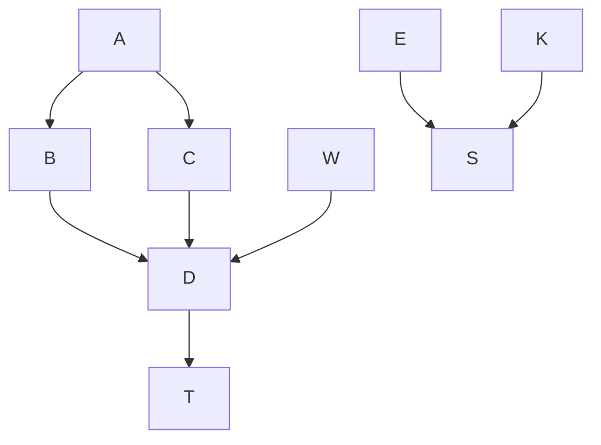
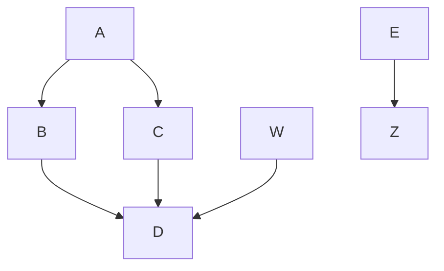

# Test this out

Here is an inline mermaid file

```mermaid
graph TD;
    A-->B;
    A-->C;
    B-->D;
    C-->D;
    W-->D;
    E-->S;
    D-->T;
    K-->S
```

Goal: comment out the above, insert image ref

```mermaid
graph TD;
    A-->B;
    A-->C;
    B-->D;
    C-->D;
    W-->D;
    E-->Z;
```
